# Coffee Shop Inventory App (LARAVEL)

Pendataan terperinci untuk stok bahan dan inventaris yang sangat Coffee Shop Friendly
## Features
- 5 Roles (Admin, HeadBar, HeadKitchen, Bar, Kitchen)
- CRUD Bahan(Bahan baku non-proses, Bahan proses, Bahan Masuk, Bahan Keluar, Bahan akhir(sisa bahan)).
- CRUD Kategori Inventory
- CRUD MENU (detail menu beserta komposisi bahan baku untuk membuat menu)
- CRUD MENU TERJUAL (Detail menu terjual untuk menyesuaikan bahan keluar dan komposisi bahan dari menu yang terjual)
- CRUD INVENTARIS (Bar, Kitchen, Operasional)
- Laporan (PEMANTAUAN BAHAN BAKU, BAHAN BAKU, BAHAN MASUK, BAHAN KELUAR)
- Real-time stock notification
- Barcode system for inventory scanning

## Requirements
- PHP >= 8.1
- Composer
- MySQL or PostgreSQL
- Node.js & NPM
## Demo


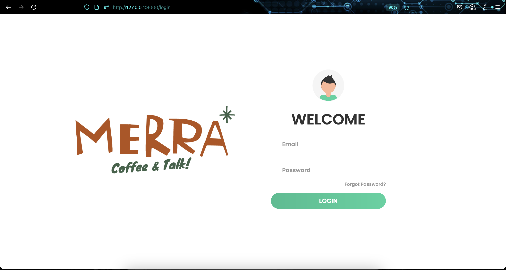
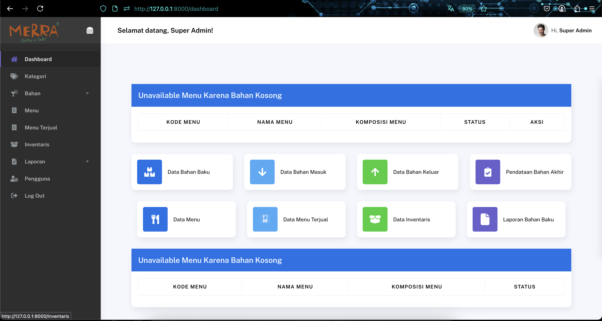
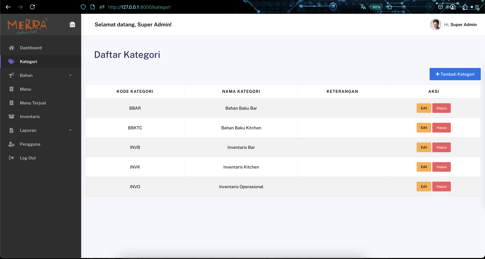
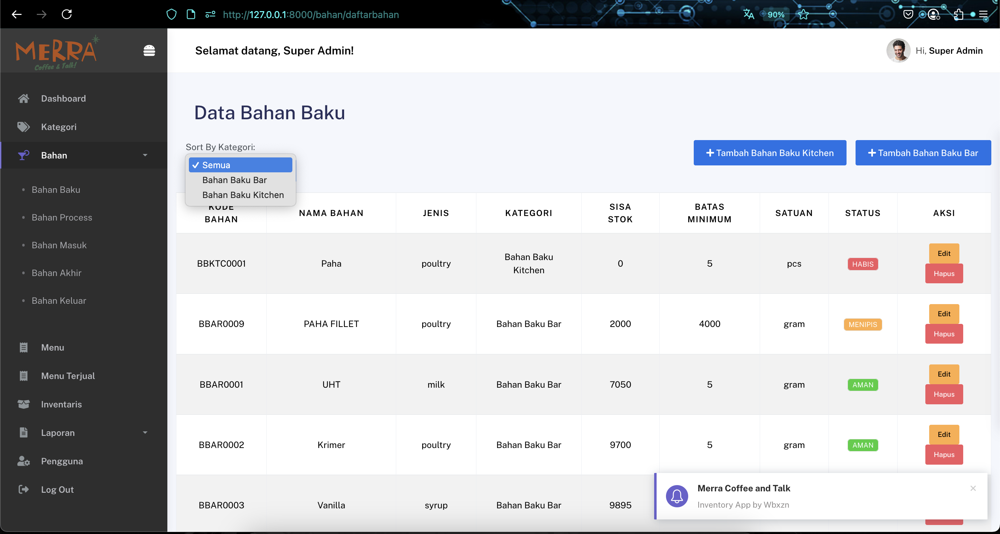
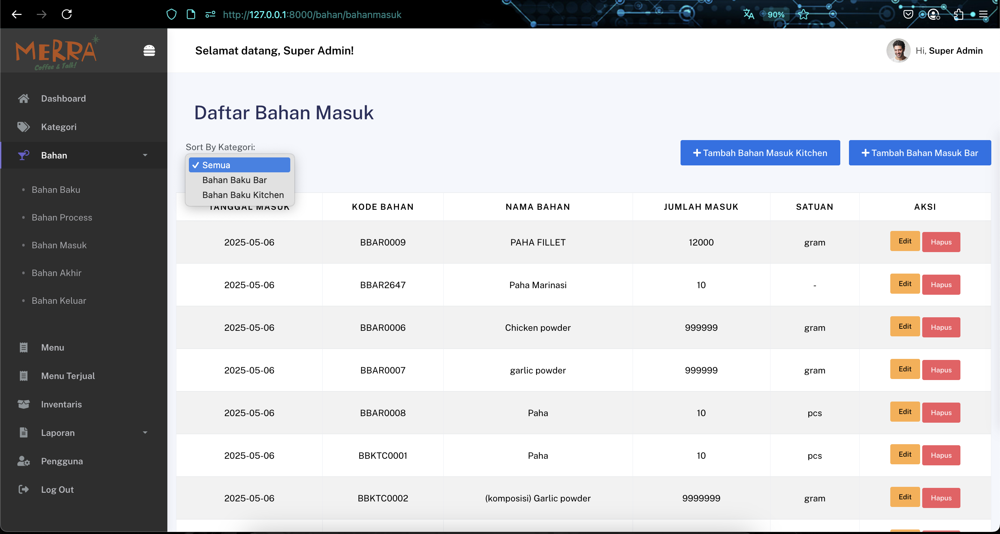
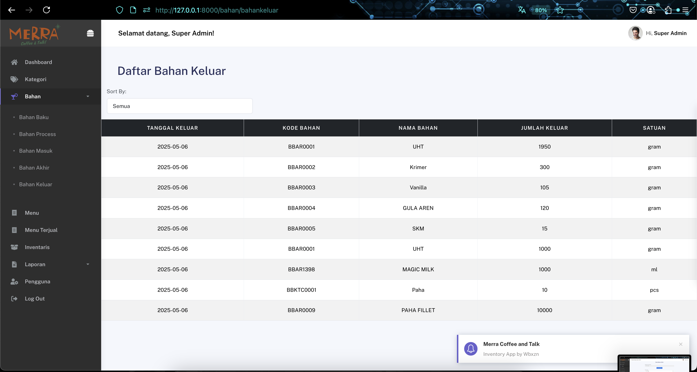
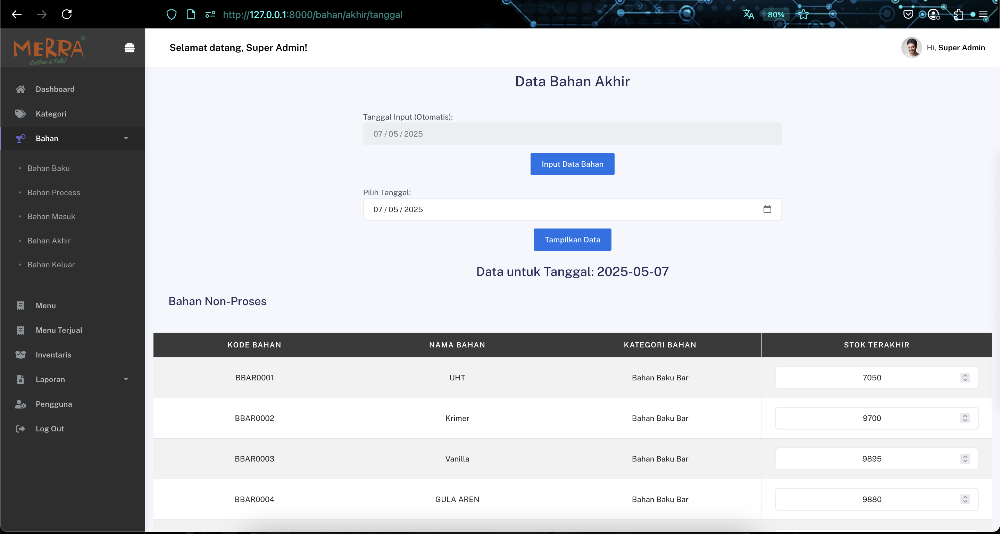
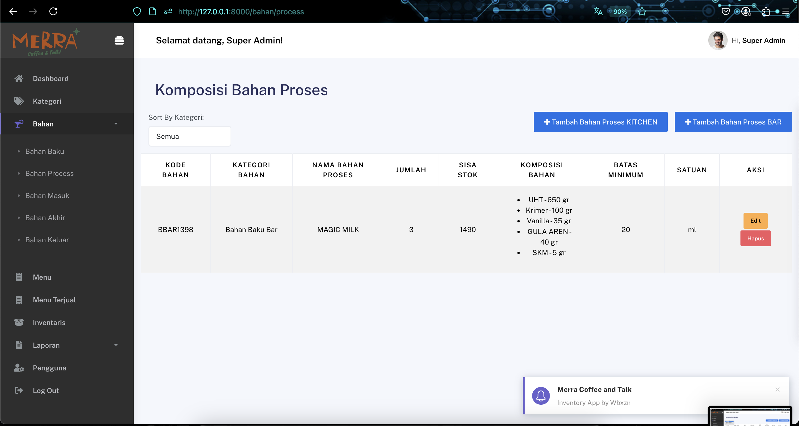
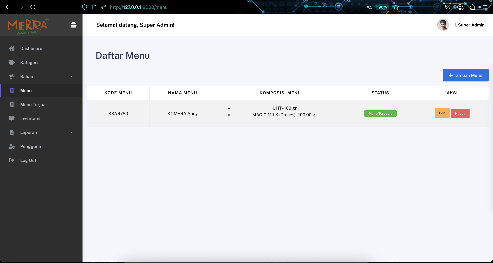
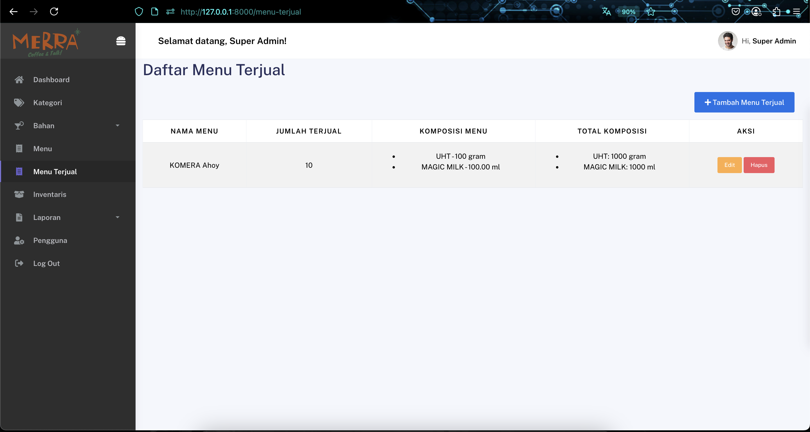
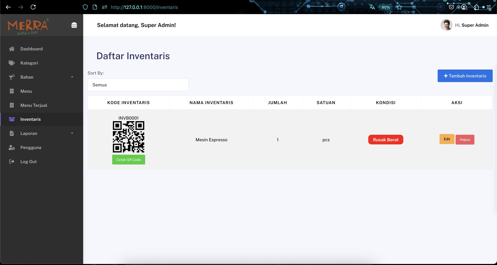
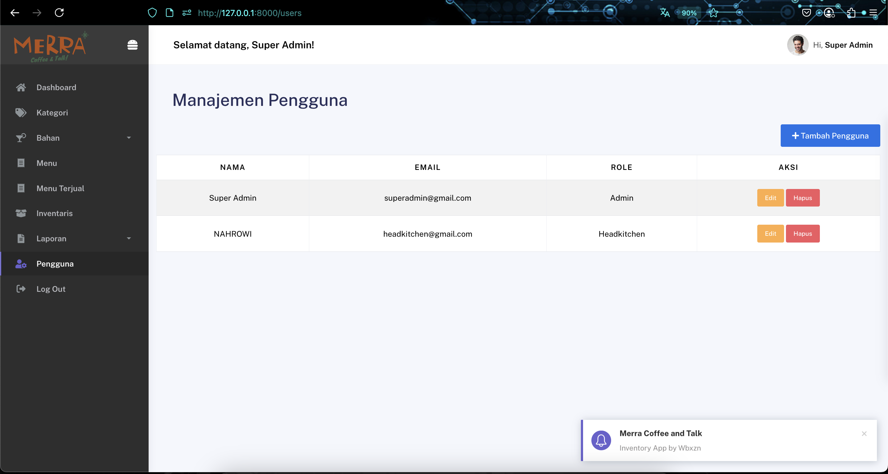
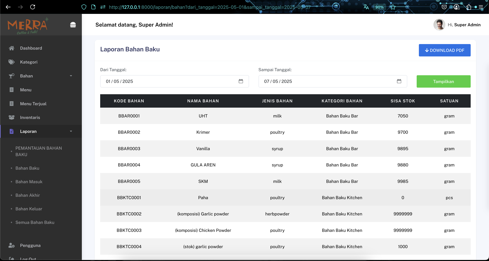
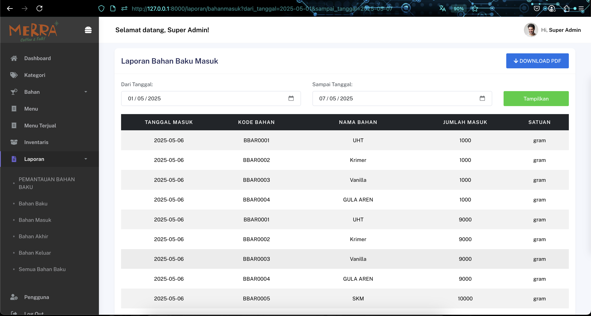

## Installation

```bash
git clone https://github.com/HexxaZen/inventoryapp.git
cd inventoryapp
cp .env.example .env
composer install
npm install && npm run dev
php artisan key:generate
php artisan migrate --seed


